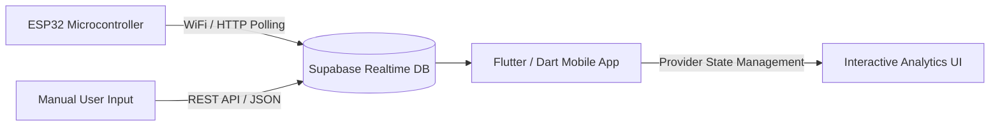

# ReefLynk

A Flutter/Dart mobile application for tracking marine aquarium parameters — salinity, pH, alkalinity, calcium, and more — with data visualization and (in progress) direct ESP32 hardware integration.

Live on the [App Store](https://apps.apple.com/us/app/reeflynk/id6759136977). Web build: [reef-lynk-web.vercel.app](https://reef-lynk-web.vercel.app)

## 🛠️ System Architecture (Current — Shipped)

ReefLynk bridges manual data entry and (feature-flagged) ESP32 hardware sensors with a mobile interface via a Supabase real-time backend.

- **Data entry:** manual parameter logging (shipped, primary path today) and direct ESP32 WiFi/HTTP polling (built, currently gated behind a feature flag — see below)
- **Backend:** Supabase Postgres + Realtime
- **App:** Flutter, Provider for state management, `fl_chart` for trend visualization

### Why the ESP32 link is hidden right now

The HTTP-based ESP32 connection layer (`ReefControllerProvider`) is implemented and functional — it polls a manually-entered device IP for live sensor readings. It's currently disabled via `FeatureFlags.isControllerEnabled` (along with the lighting-control module, `isLightingEnabled`) so the initial App Store release could ship as a focused, manual-entry tracking app without requiring users to own hardware. Re-enabling it is a flag flip once multi-device support (below) lands.

## 🧠 Roadmap: Autonomous Systems Extensions (Planned)

The architecture above is intentionally the *foundation* for a closed-loop, autonomous marine life support system — the intended direction for undergraduate senior design and a graduate non-thesis capstone (MS AI, Autonomous Systems). None of the following is built yet.

#### Near-term: Multi-tank & multi-device support
- `tanks` table + per-tank `tank_id` scoping across all data tables
- One ESP32 per tank; connection manager for N simultaneous devices
- Migrate from HTTP polling to WebSocket or MQTT for real-time, internet-capable (not just same-WiFi) telemetry

#### 1. Computer Vision-Driven Kinematics (Autonomous Glass Cleaning)
- **Implementation:** ESP32-CAM module running localized edge image classification
- **AI logic:** CNN-based real-time image segmentation to detect algae film density and location
- **Automation:** drive a motorized magnetic scrubber to target detected algae coordinate grids

#### 2. Closed-Loop Sensor Fusion (Automated Water Changes & Safety Fail-Safes)
- **Implementation:** optical water-level sensors, float switches, and peristaltic pumps interfaced with the ESP32 hub
- **Automation logic:** hard-coded fail-safe interrupt matrix — if salinity or water-level readings deviate >1.5% from baseline mid-water-change, the system triggers an emergency interrupt to prevent flooding

#### 3. Predictive Parameter Analysis (Machine Learning Dosing)
- **Implementation:** historical manual + automated telemetry as a training set
- **AI logic:** localized regression models forecasting consumption velocity of alkalinity, calcium, and magnesium
- **Automation:** proactively adjust multi-channel dosing pumps to prevent parameter swings before they stress coral tissue

## Getting Started (Flutter)

This project is a standard Flutter application. See the [Flutter docs](https://docs.flutter.dev/) for setup, or:

- [Lab: Write your first Flutter app](https://docs.flutter.dev/get-started/codelab)
- [Cookbook: Useful Flutter samples](https://docs.flutter.dev/cookbook)
